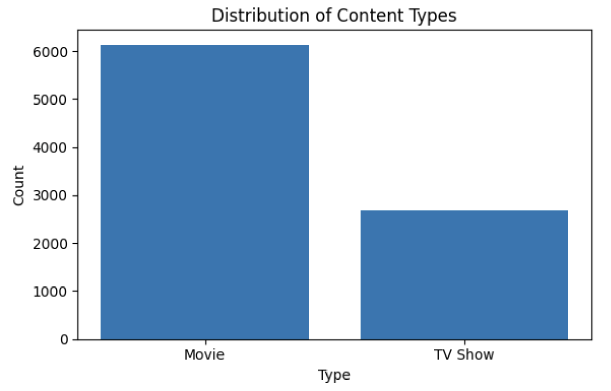

### Lab 3: CSV Analysis with Python (Netflix Dataset)

**Learning goals:**

* Load and parse CSV files using Python.
* Build custom reusable functions to process tabular data.
* Use generators with `yield` to write memory-efficient code.
* Filter and analyze records from a dataset using conditional logic.
* Create summaries, counters, and frequency tables using `for` loops and dictionaries.
* Perform basic sorting, aggregation, and statistical operations manually.

Dataset:

* Download the data from Kaggle:
  * [Netflix Movies and TV Shows](https://www.kaggle.com/datasets/shivamb/netflix-shows)

---

1. **Load the data in Python as a dictionary.**

Read the CSV data into a list of dictionaries, for later usage.

```python
import csv

with open('netflix_titles.csv', mode='r', newline='') as file:
    reader = csv.DictReader(file)
    data = [row for row in reader]

print(data[1])
```

**Here is the function implemenation.**

```python
import csv

def load_data(filename):
    with open(filename, mode='r', newline='', encoding='utf-8') as file:
        reader = csv.DictReader(file)
        data = [row for row in reader]
    return data

netflix_data = load_data('netflix_titles.csv')
print(netflix_data[0])  # Print first entry
```

**Time Complexity**: `O(n·m)`

- Opening file: `O(1)`
- Reading file line by line: `O(n)`, where n is the number of rows (excluding the header)
- Parsing each row into a dictionary: `O(n·m)`, where m is the number of columns (fields)
  - Each field is mapped to a key, so constructing a dict is `O(m)`
- List comprehension to store all rows: `O(n)`

**Space Complexity**: `O(n·m)`

* Data stores all n rows in memory
* Each row is a dictionary with m key-value pairs

------

2. **Create a function called `my_head(alist,limit)` to return the `n` first records of the dataset in a new list.**

```python

```

**Why use `yield`?**

- You get one item at a time (no list built in memory).
- It’s more efficient when you only need a few items from a large list or stream.
- Works well in pipelines or streaming scenarios.

Time Complexity: 

Space complexity:

---

3. **Create a function called `my_head_col(alist,col,limit)`  to return the first records of a sepcific column from the dataset as a list.**

```python

```

Time complexity: 

Space Complexity: 

---

4. **Filters `titles` added in the year `2021`.**

**Develop a function for `shows_added_in_2021(data)` for `titles` from United States**

* **Solution with `return`**

```python

```

Time complexity:

Space complexity: 

* **Solution with `yield`**

```python

```

**Why use `yield`?**

* Time complexity:

* Space complexity: 

---

6. **Develop a function for `shows_added_in_2021(data)` for `titles` from United States**

Lists titles where country is `United States`.

* **Solution with `return`**

```python

```

Complexities are the same as 5 `return`.

* **Solution with `yield`**

```python

```

**Complexity**

- Time complexity:
- Space complexity: 

---

7. **Titles with `love` (any case).**

Searches for titles containing the word `love` (case-insensitive).

* **Solution with `return`**

```python

```

* **Solution with `yield`**

```python

```

Time complexity:

Space complexity: 

---

8. **PG-13 Movies**

Finds all movies with a `PG-13` rating.

* **Solution with `return`**

```python

```

* Time complexity:
* Space complexity: 

```python

```

- Time complexity:
- Space complexity: 

---

9. **Develop the `my_len` function, to count the total entries**

Counts the number of rows in the dataset.

```python

```

**Can I use yield?**

?

- Time complexity:
- Space complexity: 

---

10. **Count Types**

Counts how many entries are `TV Show` vs. `Movie`.

```python

```

- Time complexity:
- Space complexity: 

------

11. **Count Per Category**

Generate a frequency table

```python

```

**Time Complexity: `O(n)`**

- The function iterates over all `n` rows once.
- Dictionary operations (`in`, `+= 1`, assignment) are on average **O(1)**.
- So the total time is **O(n)**.

**Space Complexity: `O(t)`**, where `t` is the number of unique content types

- A dictionary `type_counts` is built with one entry per unique type (e.g., "Movie", "TV Show", etc.).
- In practice, `t` is small, so this is often treated as **O(1)**.

---

12. **Average TV show seasons**

Calculates average number of seasons for TV shows.

```python

```

- Time complexity:
- Space complexity: 

---

13. Sort by release year using `Bubble sort`.

```python

```

**How Bubble Sort Works:**

- Repeatedly compares adjacent elements
- Swaps them if they're in the wrong order
- "Bubbles" the largest value to the end in each pass

Time complexity: `O(n^2)`

Space complexity: `O(n)` — due to copying the list

---

14. **Convert durations**

The function extracts numeric values from the `"duration"` field and groups them into a dictionary based on units like `"min"`, `"Season"`, or `"Seasons"`. It skips empty or malformed entries.

*It works on a list of dictionaries where each dictionary has a `'duration'` key.*

```python

```

**Output**

```python
{
    "min": [90, 91, 125, 104, 127, 91,...],
    "Seasons": [2, 2, 9,..],
    "Season": [1, 1, 1, 1, 1,...]
}
```

---

15. **What is the distribution of content types (TV Show vs Movie)?**

Create a **bar chart** showing how many titles fall into each type.

```python

```

